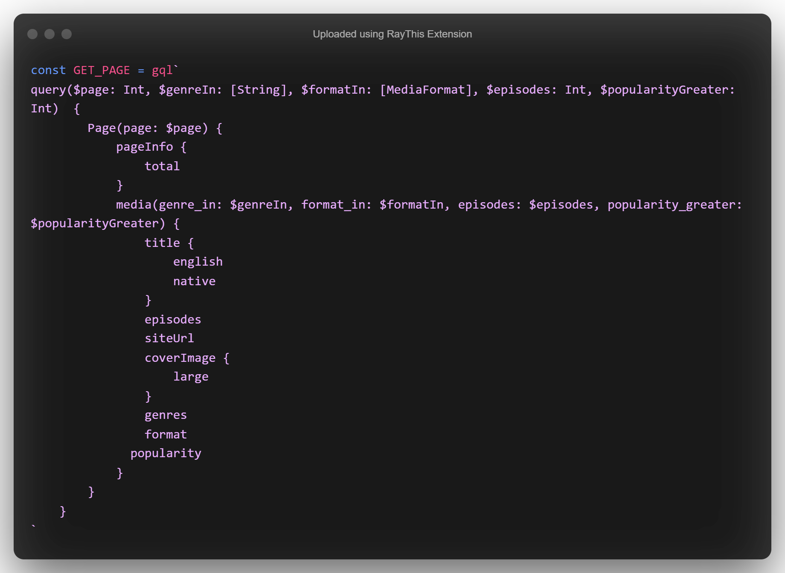

# ANILIST

[Link API](https://anilist.gitbook.io/anilist-apiv2-docs/)

## npm run start -ejecutar la app web
## npm install   -instalar las dependencias
Runs the app in the development mode.
Open http://localhost:3000 to view it in the browser.

[?](https://www.youtube.com/watch?v=xvFZjo5PgG0)